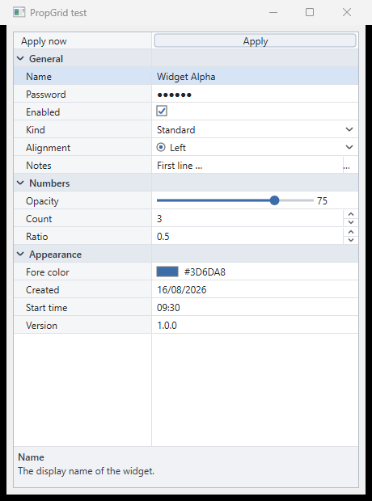

# ClaPropGrid — Direct2D Property Grid for Clarion

A fast, modern property grid for Clarion applications (9 through 12),
rendered with Direct2D/DirectWrite by a native C DLL, and integrated into
the Clarion AppGen through the `ClaPropGrid` template chain (ABC):

1. **PropGridGlobal** (application extension) — one-time global wiring:
   class include, `propgrid.lib` link, multi-DLL link/dll pragmas via ABC
   class category `PROPGRID`.
2. **PropertyGridControl** (control template, multi-instance) — drop a
   property grid on any window and feed it fields (table columns or any
   variables) picked in the template UI, with per-field editor type,
   choices, ranges, categories and descriptions.
3. **FormToPropertyGrid** (procedure extension) — point it at an existing
   form: at runtime it discovers every input control on the window, hides
   the originals, rebuilds them as rows of a property grid, and syncs
   values back on OK (or live). The form's own OK/Cancel logic keeps
   working — grid button rows simply POST `EVENT:Accepted` to the original
   buttons. Placement is dockable (fill/left/right) or region-tracked.
   Its **Lookups** tab folds the classic lookup trio — code `ENTRY` +
   `'...'` **BUTTON** + description `STRING` — into **one drop-down row
   that shows the description and writes the code back**, filled from the
   lookup table at window-open time; a **Scan this window for lookups**
   button finds those trios for you, reading the file and code field
   straight out of the ENTRY's own ABC *Lookup Key* settings. Lookups you leave as buttons still
   work, and the grid now refreshes itself after the browse closes. Its
   **Added rows** tab adds rows for variables or table columns that have
   **no control on the window at all** (same field list as the control
   template), loaded and saved by generated `PGFLoad:` / `PGFSave:`
   routines. Rows from all four sources — converted controls, lookups,
   added rows, OK/Cancel — merge into one header when their category
   names match. Its **Tabs** tab handles multi-tab windows: each TAB's
   text becomes its own category (lookup rows join the tab of their code
   control), and a **Scan this window for tabs** button lists every tab
   *and every control inside it*, each taggable **Convert into the grid**
   or **Leave alone** — a tab holding a browse LIST is auto-detected and
   left alone whole (list, buttons and all), staying a live tab next to
   the grid, while tabs the conversion empties are hidden (the SHEET too,
   once its last tab goes).

The templates carry a version stamp (`v1.2 2026-08-17 14:17` in the
registry description and on each template's General tab) — if the prompt
dialog shows an older stamp than `clarion\ClaPropGrid.tpl`, the IDE is
serving a stale parsed copy: close the IDE, re-copy, re-register.

**New in v1.2** — per-category and per-row fonts (Appearance tab → *Category
fonts*, and *This row on its own* on each field / added row), rows that size
themselves to the font they carry, and values that wrap over several lines and
push the rest of the grid down.



## Features

- Direct2D + DirectWrite rendering — fast, crisp, per-monitor DPI aware.
- Editor types: text, password, drop-down list, checkbox, radio group,
  slider, spin (numeric up/down), push button, color picker, date, time,
  multiline text popup, read-only.
- Collapsible categories, draggable name/value splitter, mouse-wheel +
  keyboard navigation (arrows, PgUp/PgDn, Enter/F2, Space), hover highlight.
- Independent font face/size/bold/italic for the **name column**, **value
  column**, **category headers**, and **description pane** (`PG_SetFont`).
- Every color is configurable (`PG_SetColor`); professional steel-blue
  default palette.
- Optional description pane, border, sorted rows, toolbox look.
- **Per-category and per-row fonts** — the four global slots style the whole
  grid, and `AddFont` / `SetCategoryFont` / `SetRowFont` (plus the one-call
  `SetRowFontFace` / `SetCategoryFontFace`, and getters for all of them)
  override one category or one single row. Fonts are de-duplicated, so setting
  them in a loop is free.
- **Rows size themselves** — a row carrying a bigger font grows, and so does one
  whose value wraps; everything below moves down. `SetRowHeight` still pins them
  uniform if you want the old behaviour.
- **Wrapped multi-line values** — `SetRowWrap(row, n)` lays a long value out
  over as many lines as it needs (or caps it at *n*), measured with a real
  DirectWrite layout and re-flowed when the splitter or the window moves.
- Resizable at runtime (`PG_SetPos` / `PropGridClass.Reposition` tracks a
  placeholder REGION).
- Events delivered through a poll queue (`PG_PollEvent`, pumped from a
  Clarion TIMER) and/or an immediate C callback.

## Getting it

```
git clone https://github.com/robertorenz/formToPropGrid.git
```

`bin\propgrid.dll` and `clarion\propgrid.lib` are committed pre-built, so you can install and
use the templates without a C++ compiler — see `clarion\INSTALL.md`. Rebuild the engine only if
you change `src\`.

## Developer reference

Three bilingual (EN/ES) HTML guides in `docs/`, each a single self-contained
file — open them in a browser.

| Guide | For |
|---|---|
| [`ClaPropGrid-classes.html`](docs/ClaPropGrid-classes.html) | **The class guide.** How `PropGridClass` works: the three internal registry QUEUEs (`PropGridLookupQueue`, `PropGridTabQueue`, `PropGridCatQueue`) and their invariants, every property and method with `PropGrid.clw` line references, the equate tables, `BuildFromWindow` step by step, the sync round trip, four worked examples, the measured Clarion runtime quirks, and the template ↔ code map |
| [`ClaPropGrid-cookbook.html`](docs/ClaPropGrid-cookbook.html) | **The cookbook.** The same 16 properties and 53 methods one at a time — what each is for and Clarion code you can paste, 128 snippets in all, plus an A–Z index. The page to keep open while writing |
| [`ClaPropGrid-dll.html`](docs/ClaPropGrid-dll.html) | **The DLL API.** `PROPGRID.DLL` itself: calling convention, the `HPG` handle, the state a grid holds, all 42 exports, every `#define`, the pinned export ordinals, threading/DPI limits and a complete C host. For binding from outside Clarion |

## Repository layout

| Path | Contents |
|------|----------|
| `src/` | `propgrid.cpp/.h/.def` — the Direct2D engine; `testhost.c` — standalone visual test; `build.bat`; `make-clarion-lib.ps1` — generates the Clarion import lib (no LibMaker needed) |
| `bin/` | `propgrid.dll` (32-bit), `testhost.exe`, MSVC import lib |
| `clarion/` | `PropGrid.inc/.clw` — wrapper class (source, compiles in any Clarion version); `ClaPropGrid.tpl/.tpw` — the template chain; `propgrid.lib` — pre-built Clarion import lib (works in Clarion 9–12); `INSTALL.md` |
| `docs/` | `ClaPropGrid-classes.html` — class guide; `ClaPropGrid-cookbook.html` — every member with code; `ClaPropGrid-dll.html` — the flat C API (all EN/ES); `screenshot.png` |
| `examples/` | `PropGridDemo/` — a hand-coded Clarion app exercising the whole class (three windows: every feature, a converted form, tabs) |

The engine is C-style code compiled as C++ purely because the D2D/DWrite COM
headers are far cleaner that way; the exported surface is a flat C API,
`__stdcall`, undecorated names, ANSI strings — exactly what Clarion's
`PASCAL, RAW, NAME()` prototypes expect.

## Building the DLL

Run `src\build.bat` (needs Visual Studio 2022). It produces a **32-bit**
`bin\propgrid.dll` (Clarion apps are 32-bit), `testhost.exe` — a plain
Win32 program that exercises every editor type without involving Clarion —
and `clarion\propgrid.lib`, the Clarion import library, generated directly
from `propgrid.def` (export ordinals are pinned there as a contract; never
renumber them). The DLL statically links the CRT, so the only runtime
dependencies are stock Windows DLLs — compatible with Windows 7 SP1
through Windows 11, no VC++ redistributable required.

## Using from Clarion

See `clarion/INSTALL.md` for installation, template registration
(`ClarionCL -tr`), verified runtime notes, and deployment. In short:

```clarion
PG  PropGridClass
cat SIGNED
row SIGNED
  CODE
  PG.Init(Window, ?Region1, PGS:Border + PGS:Description)
  PG.SetFont(PGF:Name, 'Segoe UI', 9)
  PG.SetFont(PGF:Value, 'Consolas', 10)
  cat = PG.AddCategory('General')
  row = PG.AddProperty(cat, 'Customer name', PGT:Text, CUS:Name)
  row = PG.AddProperty(cat, 'Active', PGT:Check, CUS:Active)
  ! ... in the ACCEPT loop (any event):
  PG.TakeEvent()
  ! ... on OK:
  PG.SyncBack()
```

Or, for a whole form at once:

```clarion
  PG.InitXY(Window, x, y, w, h, PGS:Border)
  PG.BuildFromWindow(0, ?OK & '|' & ?Cancel)   ! converts + hides controls
```

And a lookup trio as one drop-down row (codes/names are parallel pipe lists,
built with `PG.PipeSafe()` so a `'|'` in the data cannot split them):

```clarion
  row = PG.AddFileDrop(cat, '', ?DeptCode, ?DeptName, |
                       'D01|D02|D03', 'Sales|Support|Warehouse', 'Pick a department')
  ! shows the DESCRIPTION, writes the CODE into ?DeptCode's USE variable,
  ! hides the code + description controls, takes its label from the PROMPT.
```

## License / status

Internal tool. Engine, wrapper and templates generated 2026-08-16.
